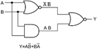
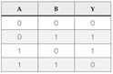
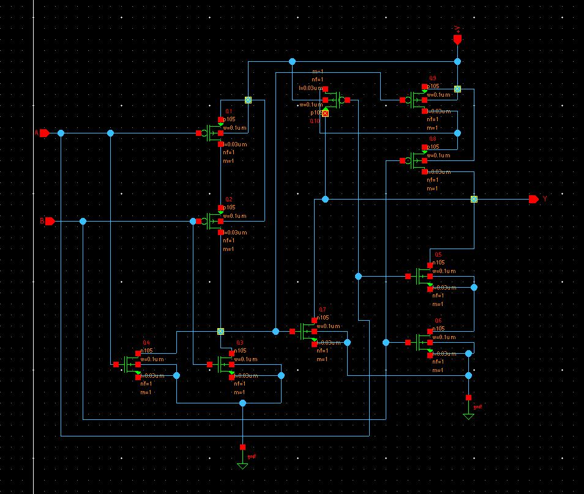
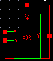
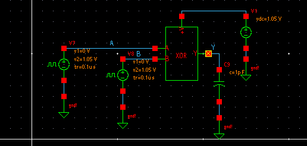
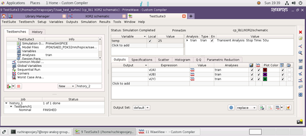
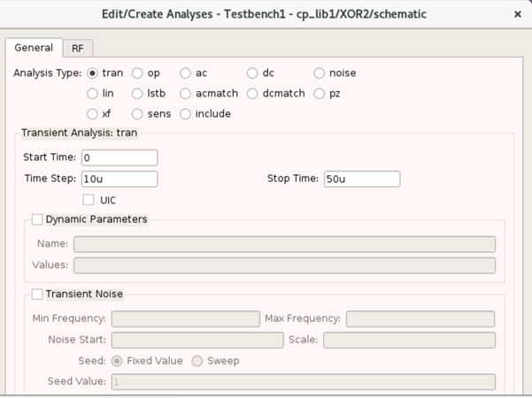
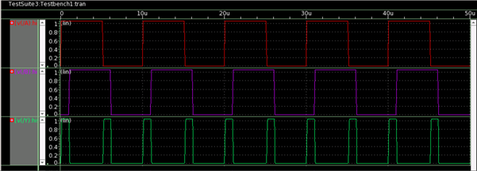

# XOR Gate Using CMOS 28nm Technology
Implementation of 2 input XOR gate using CMOS 28nm technology.

# Table Of Content
1. [Introduction](#Introduction)
2. [CircuitDesign](#CircuitDesign)
3. [ReferenceWaveform](#ReferenceWaveform)
4. [ResultAndOutputWaveform](#ResultAndOutputWaveform)
5. [Reference](#Reference)

**Abstract**:- The scope of the work is to design a two input XOR gate using 28nm CMOS. Exclusive OR (XOR) gate is utilized in various digital system applications such as full adder, comparator, parity checker and controlled inverter.

Keywords- XOR, CMOS

## Introduction 

XOR gates have many application in digital systems. Hence it is necessary to implement these gates for their various applications. Implementing circuits using only universal gates will increase the number of gates used thus we need to use basic gates to reduce the number of gates in the circuit.

A MOSFET has 4 terminals drain, gate, source and substrate. CMOS means Complementary Metal Oxide Semiconductor. The CMOS Transistor is constructed by both NMOS and PMOS Transistors. It is basically an integrated circuit built with those two transistors. As both the transistors are used, the CMOS has both characteristics. The NMOS transistors in the CMOS creates a low resistance path between the source and drain when the gate voltage is high and the PMOS transistor in the CMOS creates a low resistance path between the source and drain when the gate voltage is low. [1]

## Circuit Design 

A XOR gate can be implemented using 10 MOSFETs, 5 NMOS and 5 PMOS each.

From the truth table of the XOR gate, the output is high only when the two inputs are not equal thus it represents an inequality function. The above logic block diagram shows the implementation of XOR gate using 2 NOR and 1 AND gate. The same can be implemented using CMOS. 

MOSFETs Q1, Q2, Q3, and Q4 form the NOR gate. Q5 and Q6 do the ANDing of A and B, while Q7 performs the ORing of the NOR and AND outputs.  Q8, Q9, and Q10 complement the assembly of Q5, Q6, and Q7, inverting the output. [2]

## Reference Waveform 

The output of XOR gate is high only if the given two inputs are unequal. If A and B are the inputs to XOR gate then the output is high only if A is low, B is high or A is high, B is low.

## Result and Output 

A XOR gate is implementated according to the reference circuit using Synopsys Custom Compiler.
All the connections are made as in the reference circuit. Inputs, output and supplies are represented with pins in the initial circuit. 

The above circuit is converted into a symbol with the pins representing their respective parameters.
Pins A and B represent the inputs.
Pin Y represents the output.
Pin V+ reprents the supply to the circuit.

Voltage pulses are given to input pins and a voltage source is connected to the supply pin.
A capacitive loasd is connected to the output pin.

The input to A, B and output from Y are taken for the output waveform.

Transient analysis is selected.
Start time is set to 0us.
Step time is set to 10us.
Stop time is set to 50us.

The red wave represents the input A.
The purple wave represents the input B.
The green wave represents the output Y.

The output wave is only high when two inputs are low and high or high and low.
Thus the output waveform represents the XOR output and the truth table is satisfied.

## Reference 

[1] 	B. Razavi, Design of Analog CMOS Integrated Circuits, McGrwaw Hill Education India, 2017.

[2] 	Lorenzo Mari, CMOS implementation of XOR, XNOR and TG gates, 2021.